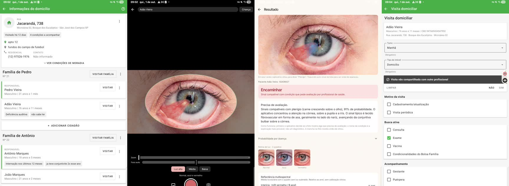
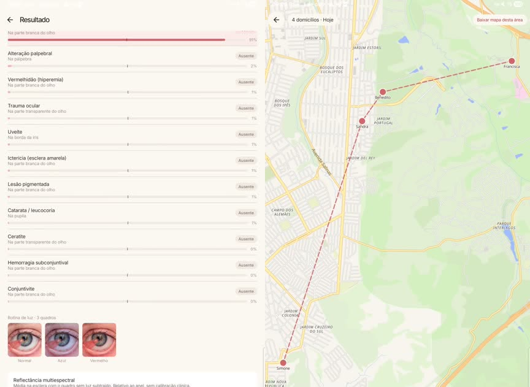
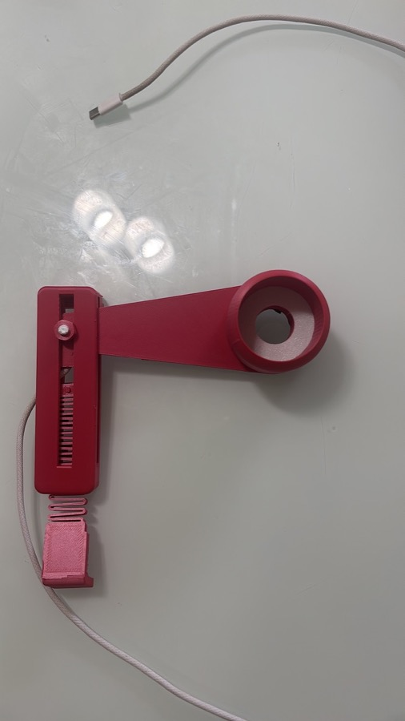
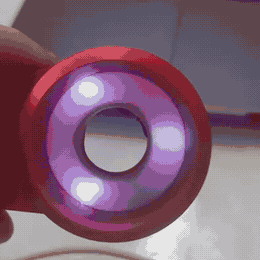
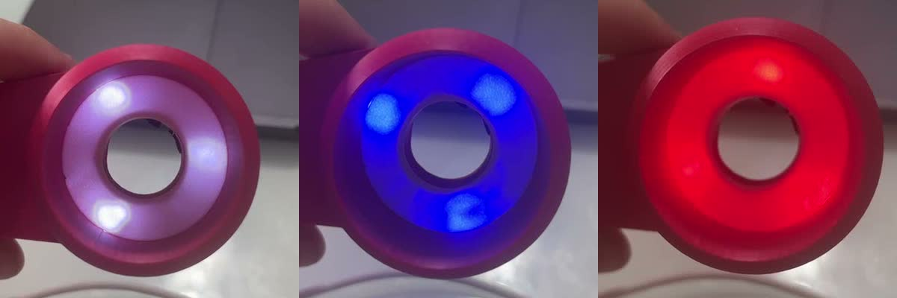

# Guaraná

**Um oftalmologista de bolso dentro da visita que já acontece.**

O Guaraná faz triagem de doenças do olho externo com a câmera do tablet do agente comunitário de saúde, sem internet, e aparece de forma discreta dentro do e-SUS Território, o sistema que o agente já usa. Um toque na pílula sobre o e-SUS abre a câmera; em segundos sai uma triagem em linguagem simples (sem sinais, observar, encaminhar, encaminhar com urgência), cruzada com a ficha da pessoa, e o registro volta para o e-SUS.

📄 **A tese completa (problema, solução, telas, tecnicalidades, hardware e impacto): [docs/tese/Guarana_tese.pdf](docs/tese/Guarana_tese.pdf)**

Triagem, nunca diagnóstico. Os números de desempenho vêm de testes em fotos públicas, não de validação clínica.

## Como é na visita



1. Na ficha do domicílio do e-SUS Território, o agente abre a visita da pessoa.
2. Toca no olho da pílula do Guaraná: a câmera abre já com o nome e o CNS lidos da tela do e-SUS, e o anel de luz faz a rotina (normal, azul, vermelho).
3. Sai a triagem em texto, no aparelho e sem internet: precisa ou não de avaliação, a condição mais provável e onde o modelo olhou (em azul na foto).
4. "Registrar visita no e-SUS" volta para a ficha e marca Busca ativa → Exame e o desfecho. O agente confere e finaliza.



As probabilidades por doença ficam recolhidas sob o resultado. O mapa do dia, também offline, mostra a próxima casa.

## Hardware v0

<p>
  
  
</p>

Suporte impresso em 3D que prende no tablet e põe um anel de luz em volta da câmera. Dentro do anel, um ESP32 controla 9 LEDs: 3 brancos, 3 azuis e 3 vermelhos. O app manda a rotina de cores pela USB a cada foto, e as fotos sob cada cor alimentam o ramo de cor (icterícia, palidez, vermelhidão).



É a primeira versão de uma lente que pode crescer para fundo de olho e outros controles de cor. Firmware e protocolo em [`firmware/`](firmware/).

## Estado

| | |
|---|---|
| App Android | funcional: captura guiada, 15 sinais offline, explicação para leigo, território, agenda, exportação PDF/FHIR |
| Integração e-SUS | pílula flutuante sobre o e-SUS Território, demonstrada num simulador fiel às telas reais; preenchimento automático da visita em andamento |
| Modelo | melhor arquitetura no banco de testes: Perception Encoder S, **92,4%** de acurácia média em fotos do Google nunca vistas (4 condições) |
| Ramo de cor | absorbância na esclera: icterícia AUROC 0,90 e vermelhidão 0,88 em fotos comuns sem controle de luz |
| Hardware | v0: suporte impresso em 3D com anel de 9 LEDs (branco, azul, vermelho) e ESP32, controlado pelo app pela USB; roadmap até lente de fundo de olho |

## Estrutura

| Pasta | O que é |
|---|---|
| `guarana-app/` | app Android (Kotlin, Compose, CameraX, ONNX Runtime) |
| `esus-mock-app/` | simulador do e-SUS Território para testar a integração (dados fictícios) |
| `firmware/` | anel de luz ESP32 (serial, BLE/Wi-Fi) e simulador HTTP |
| `treino/` | coleta de dados públicos, treino, testes externos e banco de arquiteturas |
| `sintese/` | geração de olhos sintéticos no Blender |
| `contrato/` | esquema JSON do resultado (app, motor local e nuvem) |
| `docs/` | tese em PDF e [guia técnico](docs/GUIA_TECNICO.md) e [diário técnico](docs/historico.md) |

## Rodar

App (gera `app/build/outputs/apk/release/app-release.apk`):

```bash
cd guarana-app
export JAVA_HOME=/opt/homebrew/opt/openjdk@17/libexec/openjdk.jdk/Contents/Home
./gradlew assembleRelease
```

Os modelos `.onnx` não ficam no git. Treine e publique no app:

```bash
uv venv .venv && uv pip install --python .venv/bin/python -r treino/requirements.txt
.venv/bin/python treino/treinar.py
treino/publicar_modelo.sh <versao>
```

Comparar arquiteturas com a mesma régua (300 fotos de treino e 200 de teste por classe, mais fotos do Google nunca vistas):

```bash
.venv/bin/python treino/bench_arquiteturas.py --modelos mobilenetv3_large_100 vit_pe_core_small_patch16_384.fb
```

Os dados (datasets públicos de terceiros) não são redistribuídos aqui; os scripts em `treino/` baixam e preparam cada fonte, e a lista com licenças está no diário técnico.
